# dash-mortalidad-colombia
Repo de dash python para trabajo de analisis de mortalidad en Colombia correspondiente al año 2019.

# Trabajo:
Aplicaciones 1 - Actividad 4: Aplicación web interactiva para el análisis de mortalidad en Colombia - UniSalle - Maestría en IA - Semestre 1

# Autores:

### Juan Sebastian Muñoz
### Jonatán Sebastián Villalba
### Juan David Salazar Rios


# Instrucciones:

```pip install requirements.txt```

### > Punto de partida: app.py

```python app.py```

### > Abrir en:
http://localhost:8050/


### Los datos fueron probados y limpiados usando Colab antes de construirse cada función:
https://colab.research.google.com/drive/1wHvnr58nzpBm8iQgOoc4-SM6y_r0rOcc?usp=sharing


# Análisis de Mortalidad en Colombia - Aplicación Web Interactiva

## Introducción
Dash en Python permite trabajar una aplicación web visual para análisis de datos y estadística. Se diferencia con aplicaciones como Power BI y Tableau por permitir personalización desde el primer momento, dado que cada registro se crea desde cero exactamente como el ingeniero de datos pretende mostrar la información. Dash utiliza por debajo Flask como servidor de aplicaciones y permite encapsular etiquetas HTML para renderizar una página web. Usa Plotly como estándar de visión de datos y es capaz de renderizar figuras, gráficas, tablas entre otros como un conjunto completo de datos. Al ser un sistema servidor web, permite convertir el aplicativo en un servidor web aprovechando la velocidad de montaje de Flask como servidor web.

El proyecto propuesto corresponde a una aplicación web interactiva para el análisis de mortalidad en Colombia, específicamente del año 2019. Se proveen 3 datos para la consolidación de la información:

1. **Datos de mortalidad**: Este dataset en Excel contiene la información cruda de los decesos por diversas causas de la población colombiana clasificada por diferentes parámetros entre los que se destacan principalmente ubicación del deceso, sexo, rango de edades, código muerte, entre otros.
2. **División Político-Administrativa de Colombia**: Permite determinar mediante cruce de códigos la ubicación del deceso e información regional.
3. **Nombres de los códigos de las causas de muerte**: Contiene la información detallada de las múltiples clasificaciones de decesos de la población colombiana, cruzada contra los códigos de muerte.

Con la información mencionada se proponen 10 casos:

1. **Mapa**: Visualización de la distribución total de muertes por departamento en Colombia para el año 2019.
2. **Gráfico de líneas**: Representación del total de muertes por mes en Colombia, mostrando variaciones a lo largo del año.
3. **Gráfico de barras**: Visualización de las 5 ciudades más violentas de Colombia, considerando homicidios (códigos X95, agresión con disparo de armas de fuego y casos no especificados).
4. **Gráfico circular**: Muestra las 10 ciudades con menor índice de mortalidad.
5. **Tabla**: Listado de las 10 principales causas de muerte en Colombia, incluyendo su código, nombre y total de casos (ordenadas de mayor a menor).
6. **Gráfico de barras apiladas**: Comparación del total de muertes por sexo en cada departamento, para analizar diferencias significativas entre géneros.
7. **Histograma**: Distribución de muertes, agrupando los valores de la variable GRUPO EDAD 1 según los rangos definidos en la tabla de referencia para identificar patrones de mortalidad a lo largo del ciclo de vida.

Cada caso debe ser representado como un componente visual en el aplicativo Dash y debe cumplir con los parámetros solicitados. Finalmente, una vez preparado el aplicativo web, se requiere que sea publicado en un servicio de tipo (PaaS) generando un enlace público accesible así como un enlace del repositorio trabajado durante el desarrollo.

## Objetivo
El desarrollo de este aplicativo tiene 3 objetivos principales:

1. Introducir a los estudiantes a Dash y el uso de aplicaciones interactivas web para el análisis de datos.
2. Proponer a los estudiantes resolver un reto de análisis de datos usando un set de información real.
3. Proponer una solución de análisis en la práctica que requiere el ejercicio de publicar la información para un usuario final.

## Estructura del proyecto
Para solucionar el proyecto, hemos optado por empaquetar el proyecto en un venv para instalar de forma aislada los paquetes necesarios. El punto de partida o entrypoint es `app.py`. Se empaquetan los archivos de dataset dentro de una carpeta `/data` y se utiliza una estructura básica basada en patrón repositorio. Se utiliza un DAO para extraer y formatear datos usando `openpyxl` y `pandas`. Un `service` se encarga de la lógica de negocio y tratado de datos. La información retornada se usa para renderizar componentes HTML y figuras de Plotly mediante `dcc.Graph` de Dash.

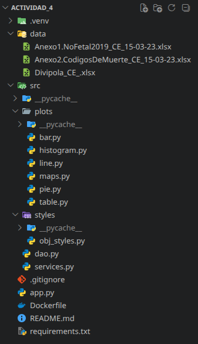

La carpeta `styles` contiene estilos de tipo clase objeto para inyectar estilos compartidos. Se incluye un `.gitignore`, un `readme.md` y un `requirements.txt` con las librerías principales (`dash`, `openpyxl`, `Flask`, `plotly`, `pandas`). Por último, un `Dockerfile` permite la ejecución mediante contenedores Docker/Podman y facilita el despliegue web.

## Un vistazo a los Requisitos
Esta aplicación está corriendo bajo Python 3 (3.11++). A continuación se muestran todas las librerías instaladas:

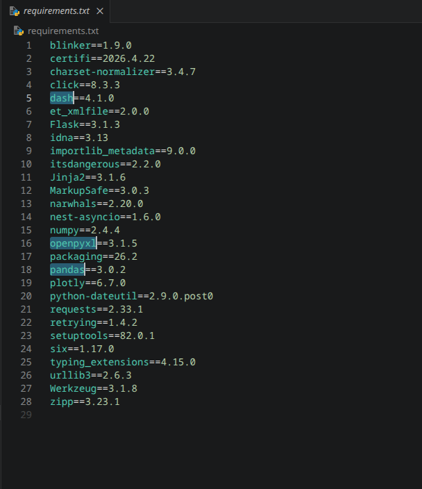

Las librerías resaltadas corresponden a la instalación básica oficial de Dash. Se ha generado una imagen de tipo OCI (Open Container Initiative) capaz de ejecutarse usando Docker o Podman.

## Despliegue
Para el despliegue se utiliza ACA (Azure Container Apps) bajo la nube Azure.

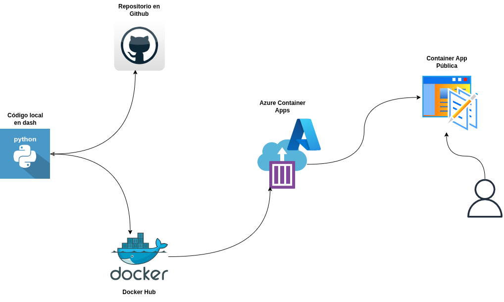

El `Dockerfile` provee una máquina Linux ligera con Python. Se exponen el puerto 8050. Puede hacer pull de la imagen: `monolith394/mortalidad-dane:v1`. Azure Container Apps permite ejecutar el servidor con un funcionamiento similar a un lambda (mínimo cero réplicas).

**Pasos para el despliegue:**
1. Buscar **Container Apps** en el portal de Azure.
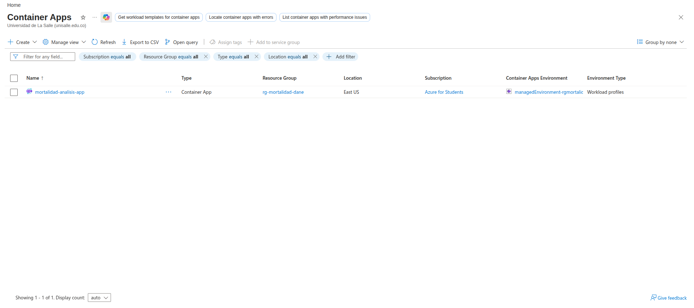
2. Configurar detalles básicos (Resource Group, Región).
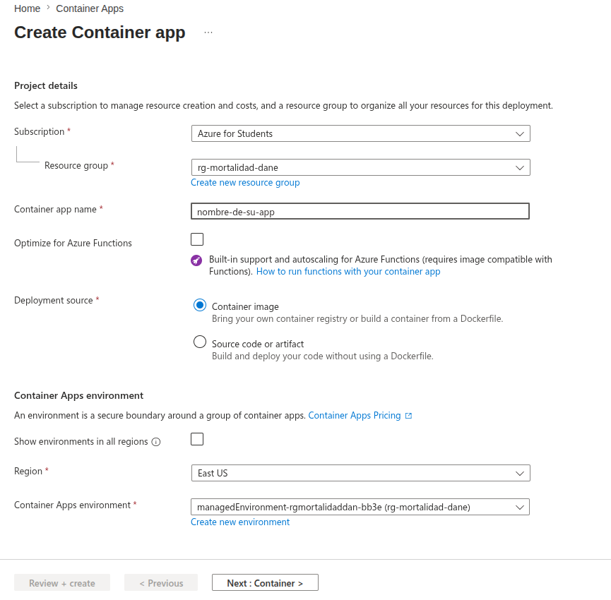
3. Seleccionar la imagen desde **Docker Hub** (`monolith394/mortalidad-dane:v1`).
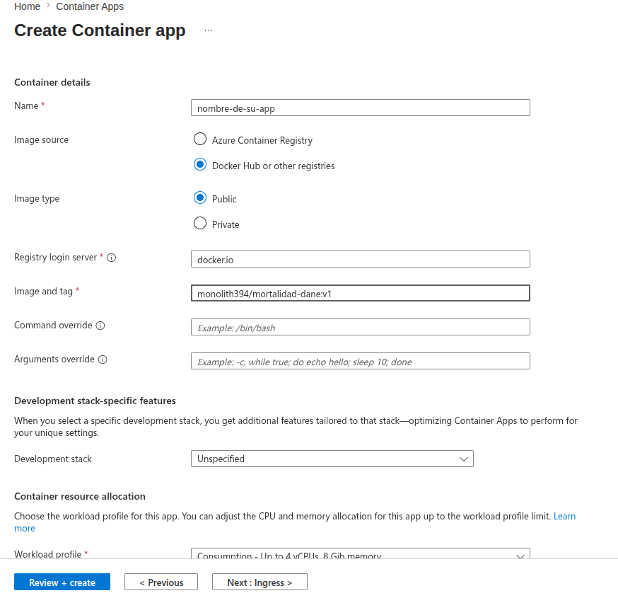
4. Configurar el **Ingress** (Habilitado, tráfico desde Anywhere, Target Port 8050).
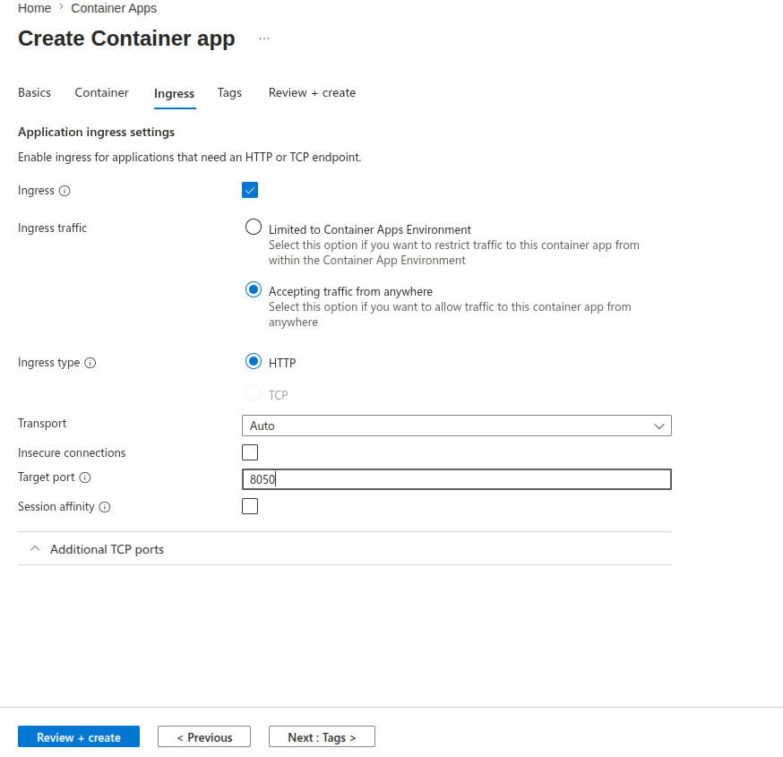
5. Revisar y Crear. Azure realizará el pull y construcción (aprox. 5 min).
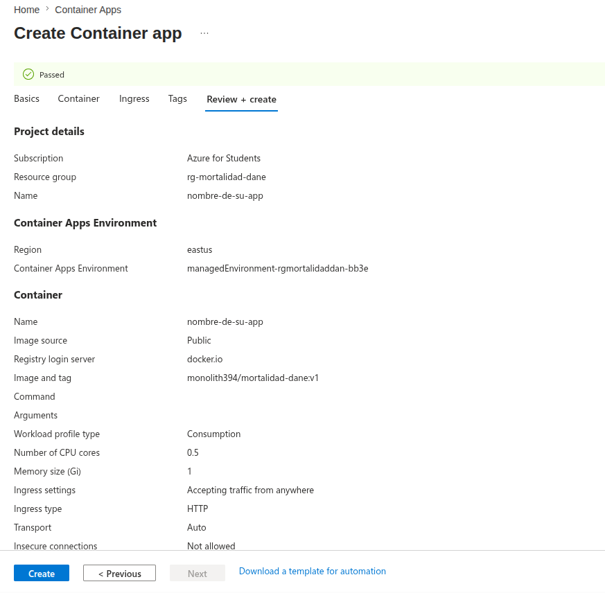
6. Acceder a la URL pública en estado Running.
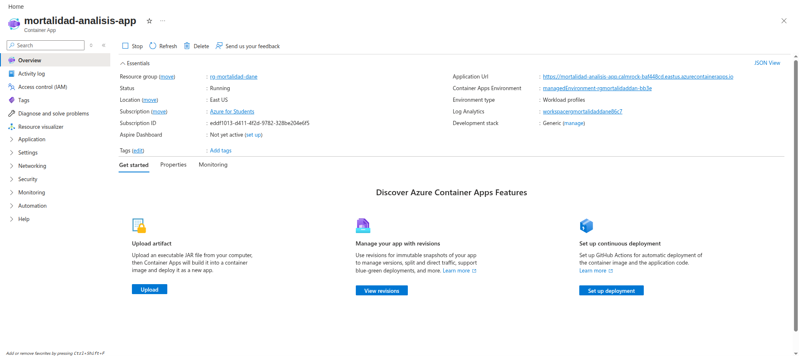

> **Nota sobre el rendimiento:** Debido a la arquitectura de escalado a cero (*Scale-to-Zero*) implementada para optimizar el consumo de recursos, la aplicación puede experimentar una latencia inicial de aprovisionamiento (*Cold Start*). Este proceso implica la instanciación del contenedor y el levantamiento del servidor Flask, lo cual puede tomar entre 1 y 3 minutos en la primera petición.

URL del aplicativo: [https://mortalidad-analisis-app.calmrock-baf448cd.eastus.azurecontainerapps.io](https://mortalidad-analisis-app.calmrock-baf448cd.eastus.azurecontainerapps.io)

## Software
Se utilizó **Google Colab** para desarrollar la parte analítica inicial y **Only Office** para el análisis de hojas de cálculo.
Enlace al Colab: [Análisis Mortalidad Colab](https://colab.research.google.com/drive/1wHvnr58nzpBm8iQgOoc4-SM6y_r0rOcc?usp=sharing)

## Instalación
Repositorio: [https://github.com/juanmunoz9304/dash-mortalidad-colombia.git](https://github.com/juanmunoz9304/dash-mortalidad-colombia.git)

**Ejecución local con Docker:**
```bash
docker pull monolith394/mortalidad-dane:v1
docker run -d -p 8050:8050 --name dashboard-mortalidad monolith394/mortalidad-dane:v1
http://localhost:8050 o
http://127.0.0.1:8050

```


#Resultados

El aplicativo se dividió en algunas secciones:

1. **Services**: Lógica de negocio. Instrucciones de tratamiento de datos. Recibe repositorio de información a través de inyección de dependencias.
2. **Plots**: Preparación de figuras, plots y tablas usando Plotly. Recibe el dataset curado proveniente de services.
3. **Renderización con Dash**: Utiliza el dataset curado y la construcción de las figuras usando Plotly para presentarlas en la parte visual e interactiva.

Las operaciones de los services se encuentran en el 100% en el archivo `services.py` y la mayoría de lógica de negocio también se encuentra implementada en el notebook Colab mencionado anteriormente.

Los plots fueron trabajados usando **Plotly Express** usando la documentación principal de Dash. Para el mapa se usó **Graph Objects** específicamente el componente Choroplethmapbox. Vamos a abordar cada uno a continuación:

* **Mapa:** *Para este caso se solicita: Visualización de la distribución total de muertes por departamento en Colombia para el año 2019.* De todos los gráficos aplicados en este trabajo, este quizás fue el más difícil que tuvimos que aplicar. Para solucionarlo nos basamos en el ejemplo del foro de Dash Plotly [en este enlace](https://community.plotly.com/t/problems-for-insert-a-map-of-colombia-country-in-a-dashboard-with-mapbox/33141) donde preguntan sobre cómo aplicar la figura Choroplethmapbox y cómo conseguir un dataset que contenga información de GeoMap de regiones colombianas. En la respuesta proponen el uso de el siguiente [gist](https://gist.githubusercontent.com/john-guerra/43c7656821069d00dcbc/raw/be6a6e239cd5b5b803c6e7c2ec405b793a9064dd/Colombia.geo.json) que contiene un JSON con la información de las regiones de Colombia. Posteriormente en este usamos IA para entender cómo cruzar la información entre la pregunta y la respuesta del foro y el ejemplo de Choroplethmapbox oficial de Dash. El gist hace parte de la extracción de información por medio del DAO y es inyectado a través del objeto. Para extraer la información de este componente procedemos a realizar las siguientes operaciones: Obtener el total de decesos agrupados por COD DEPARTAMENTO. Hacer el cruce usando merge entre COD DEPARTAMENTO del documento No Fetales 2019 y Divipola por la información detallada por departamentos y municipios. Cruzada la información tenemos el conteo agrupado por municipio pero usando el dataset GeoMap notamos que hay unas inconsistencias con algunos nombres, uno de Bogotá y el otro de Norte de Santander por lo cual se hace la conversión ajustada a la información del JSON GeoMap. Usamos un componente para normalizar texto con Unicode con una función aplicable y finalmente obtuvimos la ubicación. Los ajustes vienen heredados del ejemplo del foro. La siguiente imagen es el resultado obtenido:

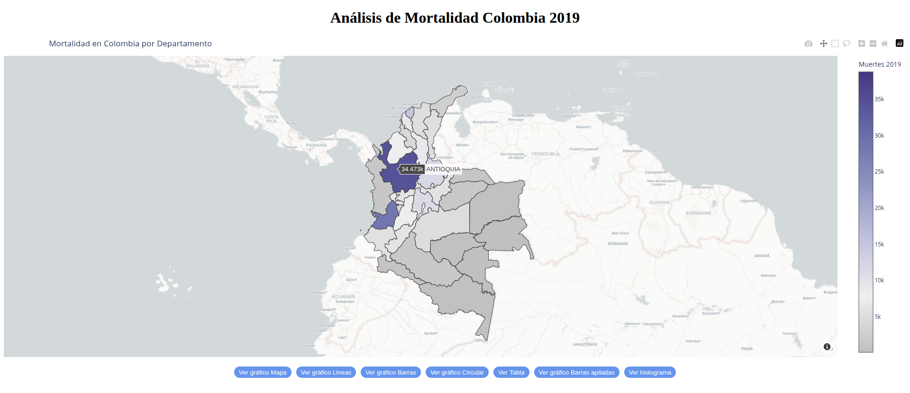

* **Gráfico de líneas:** *Representación del total de muertes por mes en Colombia, mostrando variaciones a lo largo del año.* Es más sencillo que el mapa. Se utiliza Plotly Express, usando el ejemplo oficial disponible en la página de Dash, recibe un eje (X) y un eje (Y), para calcularlo se hace la agrupación de cantidades de decesos del documento No Fetales 2019 agrupados por mes en la columna mes representados del 1 al 12. Se hace un diccionario para poder transformar la información a texto asignando cada número de mes a un texto. Posteriormente mapeamos ese diccionario al dataset para convertirlo en el nuevo eje (X) y finalmente se utiliza la información como dataframe para renderizar el gráfico dando el siguiente resultado:

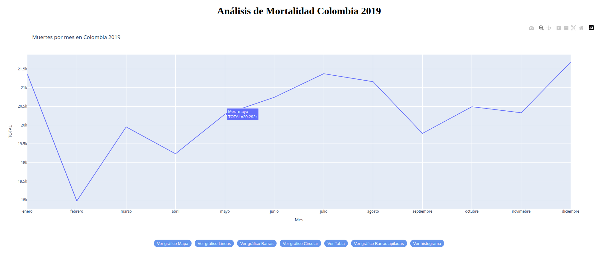

* **Gráfico de barras:** *Visualización de las 5 ciudades más violentas de Colombia, considerando homicidios (códigos X95, agresión con disparo de armas de fuego y casos no especificados).* De forma similar al anterior gráfico, se procede a analizar la información de la hoja de cálculo códigos de muerte para entender la información solicitada, dando como resultado un grupo de 10 códigos específicos para la información solicitada. Estos 10 códigos se ubican en un arreglo el cual se usa para verificar si los códigos de los decesos en No Fetales 2019 contienen ese código y si es así ahora hacen parte de un nuevo dataframe. Una vez extraída la información se procede a agrupar los elementos por municipio para obtener los valores calculados por ciudad. Finalmente como se hizo en el gráfico del mapa se cruza la información con Divipola para obtener como resultado las ciudades pero con información en texto. Se procede a ordenar de forma descendente y con un head(5) se obtienen los primeros 5 dando como resultado el siguiente gráfico:

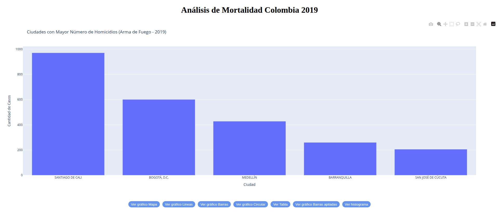

* **Gráfico circular:** *Muestra las 10 ciudades con menor índice de mortalidad.* Para realizar este, se debe hacer casi la misma operación anterior pero sin discriminar por códigos de muerte y ahora ordenando de forma ascendente con un head(10). Dando como resultado el siguiente gráfico:

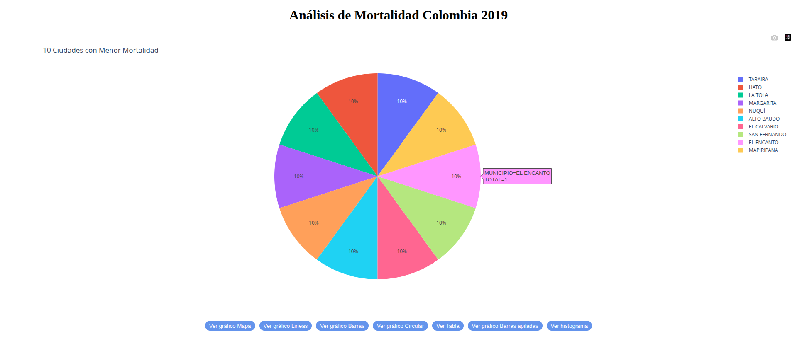

* **Tabla:** *Listado de las 10 principales causas de muerte en Colombia, incluyendo su código, nombre y total de casos (ordenadas de mayor a menor).* Para obtener la información de este se debe usar el dataset de No Fetales 2019 pero ahora sin agrupar por ciudad, ahora agrupando por códigos de muerte. La información de los códigos se debe cruzar con la hoja de códigos de muerte para obtener los detalles específicos en texto usando merge y ordenando de forma ascendente por cantidad de decesos. Para este ejemplo se usa Dash Table tomando uno de los múltiples ejemplos de la documentación oficial. El resultado es la siguiente tabla:

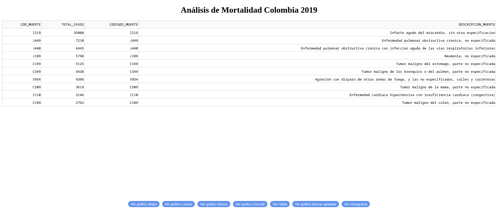

* **Gráfico de barras apiladas:** *Comparación del total de muertes por sexo en cada departamento, para analizar diferencias significativas entre géneros.* Para trabajar el siguiente gráfico se usa uno de los ejemplos de la documentación oficial de Dash, el cual utiliza como mismo generador de figuras a Plotly Express específicamente de tipo bar pero añadiendo barmode=stack. Adicionalmente se debe añadir otro parámetro denominado como color el cual podrá diferenciar componentes de cada barra, este debería ser asignado a la variable con menor cantidad de elementos entre X y Y. Para trabajar con la data se realiza una agrupación por dos componentes, 1. por departamento dado que es una de las variables solicitadas para filtrado y 2. por sexo, el cual se encuentra clasificado numéricamente siendo 1 = Masculino, 2 = Femenino y 3 = Indeterminado. Al igual que los anteriores ejemplos es necesario mapear esta información de forma manual dado que no se encuentra disponible para ser cruzada en ninguna de las demás hojas de cálculo. Se procede a hacer el debido cruzado de información por medio de merge con Divipola para obtener la información en texto de los municipios y dando como resultado el siguiente gráfico:

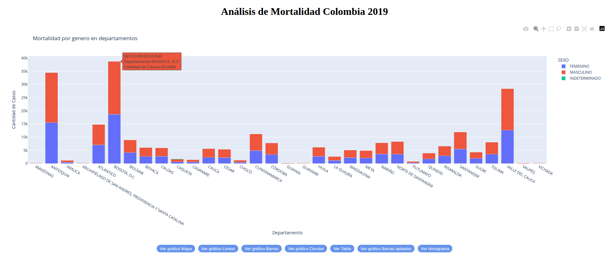

* **Histograma:** *Distribución de muertes, agrupando los valores de la variable GRUPO EDAD 1 según los rangos definidos en la tabla de referencia para identificar patrones de mortalidad a lo largo del ciclo de vida.*

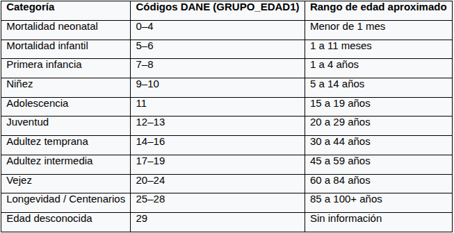

Para trabajar este caso procedemos a analizar la tabla y a definir un mapeo que concuerde con la información. Decidimos usar rangos de tal forma que sea función local la que determine si un grupo de edad se encuentra en algún rango establecido y pueda devolverse el valor texto. Una vez hecho eso, procedemos a recategorizar usando la misma información por grupo de edad a cada uno de los individuos en No Fetales 2019. Posteriormente se agrupa por esa categoría de edades para obtener un conteo consistente agrupado. El resultado es el siguiente:

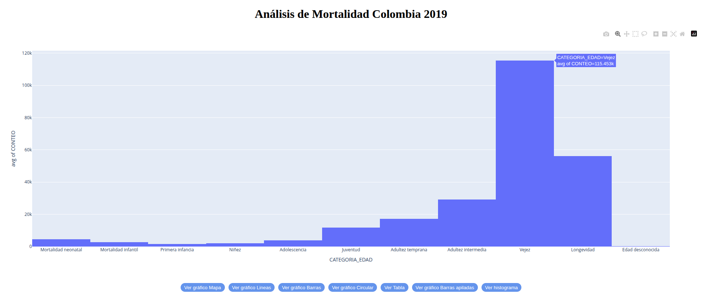

Para realizar este gráfico tuvimos que tener algunas cosas en cuenta. El histograma renderiza bien la información como histograma siempre y cuando el valor X sea numérico dado que puede representar incrementos en zonas cercanas a los valores. Para este ejercicio se hizo de esa forma sin embargo solo se modificó los labels para que renderizaran la información en forma de texto y fuese entendible. El histograma por defecto renderiza las barras separadas así que se tuvo que generar una configuración de actualización del layout. Presente también en el gráfico de mapa para asignar un bargap=0 que hace que las barras no tengan una distancia o salto entre sí.

## Resumen de Componentes del proyecto

| Nombre del componente | Url de acceso |
| :--- | :--- |
| **Aplicación Web (PaaS)** | [https://mortalidad-analisis-app.calmrock-baf448cd.eastus.azurecontainerapps.io](https://mortalidad-analisis-app.calmrock-baf448cd.eastus.azurecontainerapps.io) |
| **Repositorio GitHub** | [https://github.com/juanmunoz9304/dash-mortalidad-colombia.git](https://github.com/juanmunoz9304/dash-mortalidad-colombia.git) |
| **Análisis en Google Colab** | [https://colab.research.google.com/drive/1wHvnr58nzpBm8iQgOoc4-SM6y_r0rOcc?usp=sharing](https://colab.research.google.com/drive/1wHvnr58nzpBm8iQgOoc4-SM6y_r0rOcc?usp=sharing) |
| **Imagen Docker Hub** | `monolith394/mortalidad-dane:v1` |
| **Tecnologías Principales** | Python, Dash, Plotly, Flask, Azure Container Apps, Docker/Podman |
